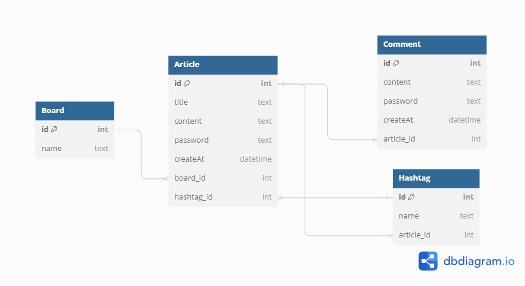

# 스프링 기초 - 게시판 웹사이트

이 프로젝트는 Ktech Back-end 과정의 일환으로, 사용자가 개인 정보를 드러내지 않고 의견을 교환할 수 있는 웹 게시판을 만드는 것을 목표로 합니다. 사용자는 게시글과 댓글을 작성, 수정, 삭제할 수 있으며, 비밀번호로 본인임을 증명해야 합니다.

## 주요 기능

- 게시판 관리
- 게시글 관리
- 댓글 관리

## 기술 스택

- **Java**: 백엔드 언어
- **Spring Boot**: 프레임워크
- **Thymeleaf**: 서버 사이드 템플릿 엔진
- **JPA**: 데이터베이스 관리
- **SQL Database**: 개발용 인메모리 데이터베이스
- **Gradle**: 빌드 도구
- **Bootstrap**: 프론트엔드 스타일링

## 데이터베이스 모델

아래는 프로젝트의 데이터베이스 모델을 나타내는 다이어그램입니다:




## 체크리스트

### 게시판 기능
- [x] 다양한 주제의 게시판 목록을 보여주는 화면
- [x] 게시판 선택 시 해당 게시판의 게시글 목록 출력
- [x] 전체 게시글을 위한 전체 게시판 구현
- [x] 게시글 제목을 클릭하면 상세 페이지로 이동

### 게시글 기능
- [x] 게시글 작성 페이지 구현
- [x] 게시글 수정 기능 (비밀번호 확인)
- [x] 게시글 삭제 기능 (비밀번호 확인)
- [x] 게시글 상세 페이지에 댓글 기능 포함

### 댓글 기능
- [x] 댓글 작성 기능 (비밀번호 확인)
- [x] 댓글 삭제 기능 (비밀번호 확인)
- [x] 댓글 목록 출력

### 도전 과제
- [ ] 게시글 이전글/다음글 네비게이션 기능
- [ ] 해시태그 기능
- [ ] 검색 기능 (제목, 내용)

## 추가 도전 과제

- [ ] 게시글 네비게이션 기능
- [ ] 해시태그 기능
- [ ] 검색 기능


## 실행 방법

1. **프로젝트 클론**:
   ```bash
   git clone https://github.com/your-username/your-repository.git
   cd your-repository

2. **프로젝트 빌드**:
   ```bash
   ./gradlew build

3. **애플리케이션 실행:**:
     ```bash
    Run file: 
    DiscussionBoardApplicationTests.java

4. **웹 브라우저에서 접속:**:
    
    `http://localhost:8080` 으로 접속하여 애플리케이션을 확인합니다.
   
